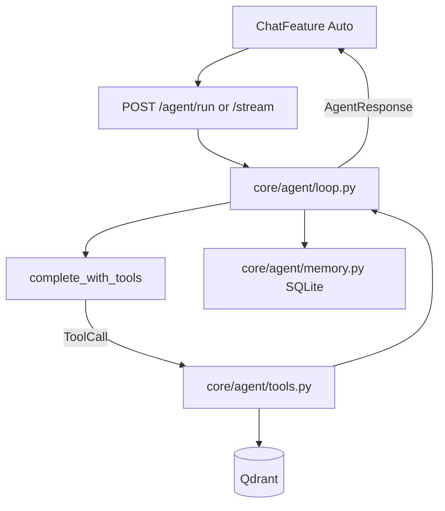

# Agent layer

Peggy ships a **reactive agent** (ReAct loop with tools) alongside **single-shot** `/chat` workflows.

## Two paths

| Path | When | Endpoint |
|------|------|----------|
| **Agent** | Ask Peggy → **Auto** mode | `POST /agent/run` or `POST /agent/stream` |
| **Single-shot** | Ask / Gaps / Compare chips | `POST /chat` or `/workflows/*` |

`POST /chat` is unchanged. Auto in the UI uses the agent; manual modes still use intent routing + one-shot workflows.

## Agent architecture



## API

### `POST /agent/run`

```json
{
  "query": "What gaps exist in microbiome T2D given our findings?",
  "session_id": "uuid-from-frontend",
  "mode": "auto",
  "source_types": ["literature", "own_findings"]
}
```

Response (`AgentResponse`):

```json
{
  "answer": "…",
  "body": { "gaps": [], "summary": "…" },
  "sources": [],
  "steps": [{ "step": 1, "type": "tool", "tool": "search_corpus", "summary": "…" }],
  "tools_used": ["search_corpus", "run_gap_analysis"],
  "confidence": "medium",
  "limitations": [],
  "truncated": false,
  "session_id": "…"
}
```

### `POST /agent/stream`

SSE events: `step_start`, `tool_call`, `tool_result`, `final` (with full `AgentResponse` on `final`).

## Tools (v1)

| Tool | Wraps | Notes |
|------|--------|-------|
| `search_corpus` | `qdrant_store.search()` | Primary retrieval |
| `list_corpus` | `catalog.list_papers()` | Metadata only |
| `search_pubmed` | `search_pubmed()` | PMIDs only — **no auto-ingest** |
| `get_paper_metadata` | `fetch_by_pmid()` + catalog | |
| `run_gap_analysis` | `run_gap_analysis()` | |
| `compare_finding` | `run_compare()` | |
| `summarise_context` | thin `complete()` helper | Long tool output compression |

**Deferred:** `ingest_pubmed` / `ingest_pdf` (surprise corpus writes).

## Mode constraints

| `mode` | Tools |
|--------|-------|
| `auto` | Full set |
| `chat` | `search_corpus`, `list_corpus`, `summarise_context` |
| `gap_analysis` | Search + `run_gap_analysis` |
| `compare` | Search + `compare_finding` |

## Session memory

SQLite tables `agent_sessions` / `agent_messages` in `catalog.py`. Frontend stores `session_id` in `sessionStorage`. `summarise_if_long()` compresses history when context grows.

Qdrant `chat_history_logs` remains unused (cross-session semantic memory deferred).

## LLM

- `LLMProvider.complete_with_tools()` in `core/llm/provider.py`
- **Groq / OpenAI:** native OpenAI-style `tools` API
- **Ollama:** native tools if supported; else JSON fallback `{"type":"tool_call",…}`

For agent development, use `LLM_PROVIDER=groq` + `GROQ_API_KEY` ([LOCAL.md](LOCAL.md)).

## Guardrails

- `max_steps=6` hard cap → `truncated: true` + partial answer
- Only registered tools execute; unknown names error
- Persona agent block in `persona_config.json`; `build_agent_system_prompt()` in `prompts.py`

## Single-shot `/chat` (still available)

| Mode | Behavior |
|------|----------|
| `auto` | Intent detection in `intent.py` (keyword routing) — **not** used when UI is on Auto (agent) |
| `chat` | `grounded_chat()` |
| `gap_analysis` | `run_gap_analysis()` |
| `compare` | `run_compare()` |

## Code locations

| Piece | Path |
|-------|------|
| Tools | `services/peggy-api/core/agent/tools.py` |
| Loop | `services/peggy-api/core/agent/loop.py` |
| Memory | `services/peggy-api/core/agent/memory.py` |
| Router | `services/peggy-api/routers/agent_router.py` |
| Schemas | `services/peggy-api/schemas/agent.py` |
| LLM tools | `services/peggy-api/core/llm/provider.py` |
| UI | `apps/web/features/chat/ChatFeature.tsx` |

## Not built yet

| Capability | Status |
|------------|--------|
| Ingest tools in agent loop | Deferred |
| Qdrant cross-session memory | Deferred |
| Proactive monitoring | Deferred |
| MCP server | Optional later |

See [ROADMAP.md](ROADMAP.md).

## Related docs

- [ARCHITECTURE.md](ARCHITECTURE.md) — API and collections
- [LOCAL.md](LOCAL.md) — Groq dev profile, smoke test
- [TESTING.md](TESTING.md) — agent unit tests
