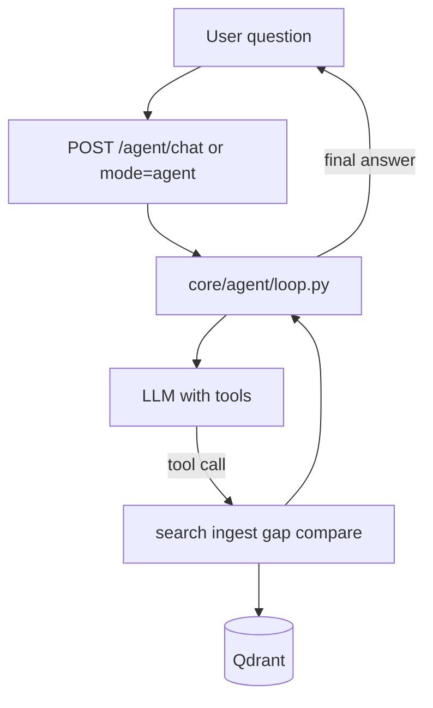

# Agent layer — current state and plan

Peggy today is **retrieval + single-shot LLM workflows**, not a multi-step autonomous agent. This doc separates what ships now from what is planned.

## What exists today

### Intent routing on `/chat` (lightweight)

`POST /chat` accepts `mode`: `auto` | `chat` | `gap_analysis` | `compare`.

| Mode | Behavior |
|------|----------|
| `auto` | `core/rag/intent.py` picks workflow from keywords (e.g. “gap analysis”, “compare”) |
| `chat` | Grounded Q&A — `grounded_chat()` |
| `gap_analysis` | Same as `POST /workflows/gap-analysis` — structured `body.gaps` |
| `compare` | Same as `POST /workflows/compare` — uses `query` as the finding text |

Response shape (`ChatResponse`):

```json
{
  "mode": "gap_analysis",
  "response": "summary string",
  "body": { "gaps": [...], "summary": "..." },
  "sources": [...],
  "confidence": "medium",
  "limitations": [...]
}
```

**Not agentic:** one HTTP request → one retrieval → one LLM call. No tool loop, no session memory, no proactive jobs.

### Dedicated workflow tabs

`/gaps` and `/compare` call the same backend workflows directly. Ask Peggy can run them via mode chips or auto intent.

### Code locations

| Piece | Path |
|-------|------|
| Intent detection | `services/peggy-api/core/rag/intent.py` |
| Chat router | `services/peggy-api/routers/chat_router.py` |
| Workflows | `services/peggy-api/core/rag/workflows.py` |
| UI modes | `apps/web/features/chat/ChatFeature.tsx` |

## What is not built

| Capability | Status |
|------------|--------|
| `core/agent/loop.py` — think/act/observe loop | Not started |
| `core/agent/tools.py` — PubMed, ingest, search, gap | Not started |
| `LLMProvider.complete_with_tools()` | Not started |
| Session memory (`chat_history_logs` collection exists but unused) | Not started |
| Streaming (SSE) for long Ollama runs | Not started |
| Proactive monitoring (scheduler, alerts) | Deferred |
| MCP server (Peggy tools in Claude/Cursor) | Optional later |

See [ROADMAP.md](ROADMAP.md) for priority.

## Planned: reactive agent (Phase 3)

**Prerequisite:** local stack trusted — Ollama/Groq working, ingest, chat, gaps on real corpus ([LOCAL.md](LOCAL.md) Phase 0).

### Target architecture



### Tools (wrap existing functions)

| Tool | Maps to |
|------|---------|
| `search_corpus` | `qdrant_store.search()` |
| `ingest_pubmed` | `run_ingest_job` / queue |
| `gap_analysis` | `run_gap_analysis()` |
| `compare_finding` | `run_compare()` |
| `list_corpus` | `catalog.list_papers()` |

### LLM constraints

- **Groq / OpenAI:** reliable JSON tool calls — preferred for agent loop in cloud.
- **Ollama:** model-dependent; `llama3.2` partial support — test before relying on tools locally.

### Guardrails (already in prompts; extend for agent)

- Every claim must cite `chunk_id` from retrieval.
- Return `limitations` when corpus is thin.
- Max steps (e.g. 8) to prevent infinite loops.

## Reactive vs proactive

| Style | Description | Peggy plan |
|-------|-------------|------------|
| **Reactive** | User asks → agent picks tools → answers | **First target** |
| **Proactive** | Peggy watches corpus, flags new gaps on ingest | After deploy + auth; needs scheduler |

## Optional: MCP (pluggable skills)

Expose ingest/search/gap as an **MCP server** so external agents (Claude Desktop, Cursor) call Peggy without the built-in loop. The FastAPI backend is most of the way there — add thin MCP adapter over existing routes.

Not required for the in-app reactive agent.

## Related docs

- [ARCHITECTURE.md](ARCHITECTURE.md) — API and collections
- [ROADMAP.md](ROADMAP.md) — backlog order
- [SCALE.md](SCALE.md) — when to add Inngest for long agent runs
