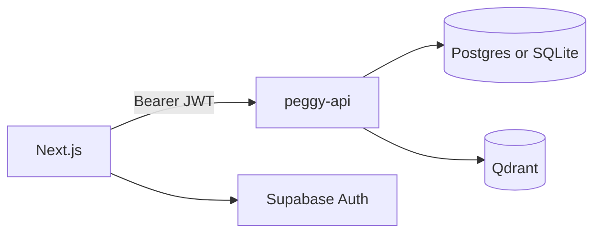

# Peggy Research Assistant — Architecture

**Local first:** [LOCAL.md](LOCAL.md) · **Production:** [SCALE.md](SCALE.md) · **Agent roadmap:** [AGENT.md](AGENT.md)

## Niche

Peggy ingests **peer-reviewed literature** and **your own findings** in separate spaces, then supports grounded Q&A, gap analysis, and comparison — with citations and stated limitations.

## Active codebase

```
apps/web/                 Next.js 14 + MUI → Vercel
services/peggy-api/       FastAPI → Railway / Render / Fly.io
scripts/ + tools/qdrant/  Native Qdrant + API (default local)
docker-compose.yml        Optional containers
legacy/                   Archived — do not import
```

## Two corpora

| UI | Route | `source_type` | Qdrant collection |
|----|-------|---------------|-------------------|
| Corpus (literature) | `/ingest` | `literature` | `peggy_literature` |
| Our findings | `/results/findings` | `own_findings` | `peggy_own_findings` |

Catalog dedup: same PMID, DOI, or normalized title within a `user_id` + `source_type` → skip insert (`duplicate` response).

## Auth (Milestone 1)

Next.js uses Supabase email magic link. FastAPI verifies JWT `sub` as `user_id` on all protected routes. See [AUTH.md](AUTH.md).



Agent session memory uses catalog tables (`agent_sessions`, `agent_messages`) scoped by `user_id`.

## Qdrant collections

| Collection | Purpose |
|------------|---------|
| `peggy_literature` | PubMed + literature PDFs |
| `peggy_own_findings` | Narrative findings + research PDFs |
| `chat_history_logs` | Reserved for cross-session semantic memory (unused) |

Embeddings: `sentence-transformers` locally. Search uses `query_points` (Qdrant client ≥1.16). All vector ops filter by `user_id` in payload.

## LLM providers

| `LLM_PROVIDER` | Use case |
|----------------|----------|
| `ollama` | Local dev (free) |
| `gemini` | Render deploy — Google AI Studio free tier |

Factory: `core/llm/provider.py` · Health: `GET /health` (`llm_reachable`, `embeddings`).

## API overview

### Ingest

| Endpoint | Purpose |
|----------|---------|
| `POST /ingest/pubmed` | PMID / DOI / search → background job (`ingested` + `skipped` duplicates) |
| `GET /ingest/jobs/{id}` | Poll job status |
| `POST /ingest/upload` | PDF or text (`source_type` form field) |
| `POST /ingest/findings` | Own-findings narrative JSON |
| `GET /discover/suggestions` | Discovery topic chips (workspace aim, profile, corpus TF-IDF) |
| `POST /discover` | Literature discovery (PubMed + Europe PMC + OpenAlex, read-only) |

### Corpus

| Endpoint | Purpose |
|----------|---------|
| `GET /corpus?source_type=` | List papers (`literature` \| `own_findings`) |
| `GET/PATCH/DELETE /corpus/{id}` | CRUD (Qdrant purge on delete: stub) |

### RAG & workflows

| Endpoint | Purpose |
|----------|---------|
| `POST /agent/run` | Reactive agent (sync) — Auto mode in UI |
| `POST /agent/stream` | Agent SSE (`step_start`, `tool_call`, `tool_result`, `final`) |
| `POST /chat` | Single-shot Ask Peggy — `mode`: chat \| gap_analysis \| compare (auto uses intent routing if called directly) |
| `POST /workflows/gap-analysis` | Structured gaps (optional `workspace_id` saves history) |
| `GET /workflows/gap-analysis/history` | Gap runs for a workspace |
| `GET /workflows/gap-analysis/{id}` | Replay a saved gap run |
| `GET /auth/github/login` | GitHub OAuth authorize URL (Bearer required) |
| `GET /auth/github/callback` | OAuth callback (stores token server-side) |
| `GET /github/repos` | List repos for linked account |
| `GET/PATCH /workspaces/{id}/study-design` | Workspace-persisted study design JSON (samples, ethics, plans) |
| `PATCH /workspaces/{id}/github` | Link repo to project |
| `POST /workspaces/{id}/github/sync` | Ingest README + `docs/*.md` as own findings |
| `POST /workflows/study-design/ethics-guidance` | FMHS ethics checklist from samples profile + optional question |
| `POST /workflows/study-design/methods-plan` | Methods review or suggest (`mode`: review \| suggest) |
| `POST /workflows/study-design/analysis-plan` | Analysis review or suggest |
| `POST /workflows/study-design/proposal` | 1–2 page proposal from workspace study design + literature |
| `POST /workflows/compare` | Finding vs literature; optional `workspace_id` injects study design + plans; retrieval includes `sample_datasets` |
| `POST /workflows/future-design` | Study design draft (API only) |
| `POST /workflows/manuscript-framing` | Discussion draft (API only) |
| `POST /feedback` | Correction queue (API only) |
| `GET /health` | Qdrant, LLM, embeddings status |

Workflow and chat responses include `sources[]`, `confidence`, `limitations`. Chat/workflow gap/compare also return structured `body`.

### Chat request example

```json
{
  "query": "Compare our butyrate finding to the literature",
  "mode": "auto",
  "source_types": ["literature", "own_findings"]
}
```

## Web routes

| Route | Nav | Purpose |
|-------|-----|---------|
| `/` | — | Project hub (pick workspace) |
| `/dashboard` | 01 Dashboard | Project strip, workflow shortcut grid (nav-driven), compact system status |
| `/ingest` | 02 Corpus | Literature only |
| `/study-design` | 03 Study Design | Redirects to first sub-section; tab bar on all sub-pages |
| `/study-design/gap-analysis` | 03 · Gap analysis | Gaps table |
| `/study-design/samples` | 03 · Samples | Cohort profile (recruitment, inclusion/exclusion) + optional PDF upload (`sample_datasets`; confirm at own risk) |
| `/study-design/ethics` | 03 · Ethics | FMHS guidance, approval letter upload (`ethics_documents`), AI checklist |
| `/study-design/budget` | 03 · Budget | Funding overview and spending constraints |
| `/study-design/methods-plan` | 03 · Methods plan | Review my plan / help me design |
| `/study-design/analysis-plan` | 03 · Analysis plan | Review my plan / help me design |
| `/study-design/proposal` | 03 · Proposal | 1–2 page study/grant draft from project context |
| `/analysis-tool` | 04 Analysis tool | Placeholder (nav disabled) |
| `/results` | 05 Results | Redirects to first sub-section; tab bar on all sub-pages |
| `/results/methods` | 05 · Methods | Placeholder |
| `/results/findings` | 05 · Our findings | Own research |
| `/results/comparison` | 05 · Comparison | Finding vs field |
| `/chat` | 06 Ask Peggy | Q&A + agent modes |
| `/login` | — | Supabase email magic link |

Legacy redirects: `/gaps` → gap analysis, `/findings` → our findings, `/compare` → comparison.

### Web UI layout

- **Dashboard shortcuts** — `getWorkflowShortcuts()` in `apps/web/lib/navigation.ts` drives the hub grid (Corpus, study-design steps, results, Ask Peggy). Disabled nav items (Analysis tool, Results Methods) are omitted.
- **Section tabs** — Study Design and Results use `SectionGroupLayout` (section eyebrow + `SectionSubNav` tabs). Sidebar child links for those groups stay collapsed on sub-routes so tabs are the primary wayfinding.
- **Page surfaces** — Inner routes use `PageSection` (single bordered panel) and `PageHeader` with `compact` under section layouts; top-level pages (Dashboard, Corpus, Chat) keep full headers.
- **Data safety** — `DataSafetyBanner` shows one line by default; expandable Details for cloud LLM and ethics guidance.

Protected routes require Supabase session (middleware). All API routes except `/health` require Bearer JWT when `AUTH_REQUIRED=true`.

## Deployment

| Layer | Milestone 1 | Milestone 2 |
|-------|-------------|-------------|
| Frontend | Vercel (auth shell) + localhost full app | Vercel + public API |
| API | localhost `:8000` | Railway / Render / Fly |
| Vectors | Local Qdrant | Qdrant Cloud |
| Catalog + auth | Supabase — [DATABASE.md](DATABASE.md), [AUTH.md](AUTH.md) |
| Jobs | Inngest (optional) | Inngest (optional) |
| Cache | Upstash Redis (optional) | Upstash Redis (optional) |

## Own-findings payload

```json
{
  "title": "Cohort alpha diversity summary",
  "cohort": "NPD",
  "findings": [],
  "narrative": "Free-text summary for embedding."
}
```

## Local development

Native (default): [LOCAL.md](LOCAL.md). Optional: [DOCKER.md](DOCKER.md).

- API: http://localhost:8000/docs  
- Web: http://localhost:3000  
- Smoke: `./scripts/smoke-local.sh`

## Legacy

`legacy/steve/`, `legacy/peggy_bot/`, `legacy/kwacha_bot/` — reference only. **Do not import in active code.**
