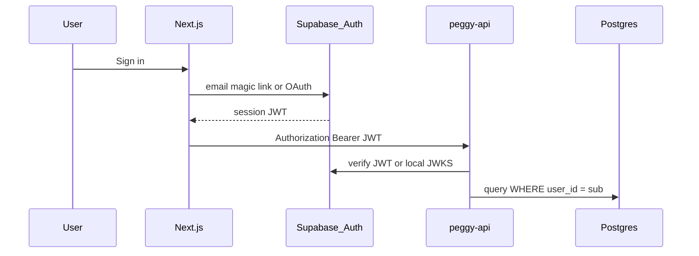

# Auth implementation plan

## Goal

Each user sees only their own corpus, ingest jobs, and chat history. Replace hardcoded `client_id: "web"` with authenticated `user_id`.

**Today (stub):** `components/ResearcherProfile.tsx` stores display name, researcher ID, and focus in `localStorage`; **Log out** clears the stub session. Wire to Supabase in Phase A below.

## Recommended approach: Supabase Auth + JWT on API

Supabase Auth integrates cleanly with **Next.js on Vercel** and **Postgres** for the catalog (see [DATABASE.md](DATABASE.md)).



## Phases

### Phase A — Supabase project + Next.js auth (1–2 days)

- Create Supabase project; enable Email magic link (or Google OAuth for lab use).
- Add `@supabase/ssr` to `apps/web`.
- Routes: `/login`, `/auth/callback`; middleware protects `/ingest`, `/chat`, `/gaps`, `/compare`.
- Pass `Authorization: Bearer <access_token>` from `lib/api.ts` on every request.

### Phase B — API JWT verification (1 day)

- Add `core/auth/deps.py`: FastAPI dependency `get_current_user()` validates Supabase JWT.
- Use `SUPABASE_JWT_SECRET` or Supabase JWKS endpoint.
- Return 401 on missing/invalid token; 403 on resource mismatch.

### Phase C — Data scoping (2–3 days)

- Add `user_id UUID` column to `papers`, `ingest_jobs`, `feedback_queue`.
- Qdrant payload: add `user_id` filter on all search/upsert.
- Migrate catalog from SQLite to Postgres (Supabase) with RLS:

```sql
ALTER TABLE papers ENABLE ROW LEVEL SECURITY;
CREATE POLICY papers_owner ON papers
  FOR ALL USING (auth.uid() = user_id);
```

- Optional: Supabase RLS as defense-in-depth; API still filters by `user_id`.

### Phase D — Polish

- Sign-out, session refresh, profile page.
- Rate limits per user (Upstash key = `user_id`).
- Admin role for shared lab corpus (optional `org_id` later).

## Alternatives considered

| Option | Pros | Cons |
|--------|------|------|
| **Supabase Auth** | Postgres + auth + storage one vendor; great Next.js DX | Vendor lock-in (mitigated: standard JWT) |
| **Clerk** | Fastest UI widgets | Extra cost; separate DB for Peggy data |
| **Auth0** | Enterprise | Heavier; overkill for solo/phd tool |
| **NextAuth.js** | Flexible | You still host user DB; more wiring |
| **API keys only** | Simple | Poor UX; no per-user corpus on web |

**Recommendation:** Supabase Auth if you adopt Supabase Postgres anyway. Otherwise **Clerk + Neon Postgres** is the second-best Vercel pairing.

## Security checklist

- Never expose `SUPABASE_SERVICE_ROLE_KEY` to the browser.
- Use `anon` key only in Next.js; API verifies user JWTs, uses service role only for admin tasks.
- Remove CORS `*` wildcard before production.
- Store LLM keys only on API host, never in `NEXT_PUBLIC_*`.

## Files to add (when implementing)

```
apps/web/
  lib/supabase/client.ts
  lib/supabase/server.ts
  middleware.ts
  app/login/page.tsx
  app/auth/callback/route.ts

services/peggy-api/
  core/auth/deps.py
  core/auth/jwt.py
```
