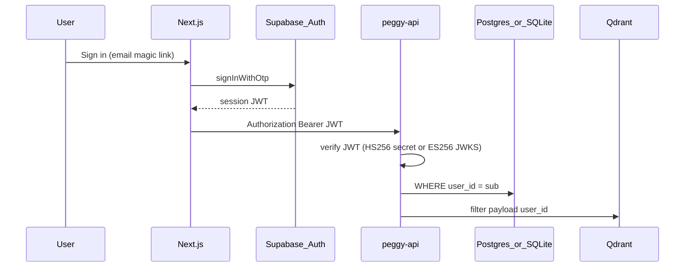

# Auth — Milestone 1 (implemented)

Each user sees only their own corpus, ingest jobs, agent sessions, and vector chunks. The API trusts JWT `sub` as `user_id` — never `client_id` from request bodies.

## Architecture


```mermaid
sequenceDiagram
  participant User
  participant Next as Next.js
  participant Supa as Supabase_Auth
  participant API as peggy-api
  participant DB as Postgres_or_SQLite
  participant Qdrant as Qdrant

  User->>Next: Sign in (email magic link)
  Next->>Supa: signInWithOtp
  Supa-->>Next: session JWT
  Next->>API: Authorization Bearer JWT
  API->>API: verify JWT (HS256 secret or ES256 JWKS)
  API->>DB: WHERE user_id = sub
  API->>Qdrant: filter payload user_id
```

## What is implemented

| Layer | Status |
|-------|--------|
| Supabase email magic link | Next.js `/login`, `/auth/callback`, `middleware.ts` |
| Bearer token on API calls | `lib/api.ts` + `AuthTokenBridge` in `providers.tsx` |
| API JWT verification | `core/auth/jwt.py`, `core/auth/deps.py` |
| User-scoped catalog | `user_id` on all tables; SQLite fallback when `DATABASE_URL` unset |
| User-scoped Qdrant | `user_id` in payload + search/scroll filters |
| CORS | `CORS_ORIGINS` only (no `*` wildcard) |
| Tests | `AUTH_REQUIRED=false` in pytest; JWT unit tests |
| Profile / logout | `ResearcherProfile.tsx` → `supabase.auth.signOut()` |

## Milestone split

| Milestone | Where full Peggy runs | Vercel role |
|-----------|-------------------------|-------------|
| **1 (now)** | localhost (API `:8000`, Qdrant `:6333`, `npm run dev`) | Auth/login shell + local-dev banner |
| **2 (later)** | Public API host + Qdrant Cloud | Full app against hosted API |

Vercel cannot call `localhost:8000`. On the deployed URL users can sign in/out; corpus/chat/ingest require the local stack until Milestone 2.

## Local setup

1. Run migration in [Supabase SQL Editor](https://supabase.com/dashboard/project/lmaugorqwhdnotpcqnnf/sql): `services/peggy-api/migrations/001_supabase_initial.sql`
2. Enable **Email** provider; add redirect URLs:
   - `http://localhost:3000/auth/callback`
   - `https://<your-vercel-domain>.vercel.app/auth/callback`
3. Set env vars per [ENV.md](ENV.md)
4. Set `AUTH_REQUIRED=true` on the API when using real auth locally

## JWT algorithms (Supabase)

Supabase now issues **ES256** (asymmetric) tokens by default. Legacy projects may still use **HS256** with the JWT secret.

| Algorithm | API env required | Verification |
|-----------|------------------|--------------|
| ES256 / RS256 | `SUPABASE_URL` | JWKS at `{SUPABASE_URL}/auth/v1/.well-known/jwks.json` |
| HS256 (legacy) | `SUPABASE_JWT_SECRET` | Shared secret from Settings → API |

If you see `Invalid token: The specified alg value is not allowed`, deploy the latest API (hybrid verifier) and ensure **`SUPABASE_URL`** is set on Render.

## Dev bypass

When `AUTH_REQUIRED=false` (default in pytest), the API uses a fixed `dev-user` id so existing tests and local smoke scripts work without tokens.

## Security checklist

- Never expose `SUPABASE_SERVICE_ROLE_KEY` or `SUPABASE_JWT_SECRET` in the browser or git.
- Use `NEXT_PUBLIC_SUPABASE_ANON_KEY` only in Next.js.
- Store LLM keys only on the API host.

## Key files

```
apps/web/
  lib/supabase/client.ts
  lib/supabase/server.ts
  middleware.ts
  app/login/page.tsx
  app/auth/callback/route.ts

services/peggy-api/
  core/auth/jwt.py
  core/auth/deps.py
  migrations/001_supabase_initial.sql
```
