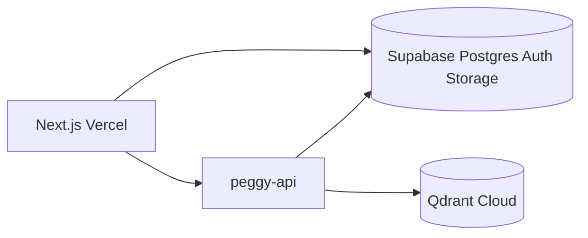

# Database & backend provider: Supabase vs alternatives

## Current state

- **Vectors:** Qdrant (`peggy_literature`, `peggy_own_findings`)
- **Catalog:** SQLite via `aiosqlite` (papers, jobs, feedback)
- **Auth:** none (`client_id: "web"` hardcoded)

## What Peggy needs from a “backend”

| Need | Qdrant | SQL DB | Auth | File storage |
|------|--------|--------|------|--------------|
| Vector search | Yes | — | — | — |
| Paper metadata, jobs | — | Yes | user scoping | — |
| Login / sessions | — | — | Yes | — |
| PDF upload (future) | — | optional | — | Yes |

Qdrant **stays** for embeddings. The question is where **relational data + auth + files** live.

## Recommendation: Supabase (Postgres + Auth + Storage)

**Best fit** for Peggy on Vercel because:

1. **Postgres** replaces SQLite for production (concurrent writes, backups, `user_id` FKs).
2. **Auth** integrates with Next.js (`@supabase/ssr`) — see [AUTH.md](AUTH.md).
3. **Storage** buckets for PDF/full-text uploads without building S3 yourself.
4. **RLS** enforces per-user corpus at the DB layer.
5. **Free tier** sufficient for solo PhD use; predictable upgrade path.

**Keep separate:** Qdrant (or Qdrant Cloud) for vectors — Supabase `pgvector` is an option later but migration cost isn’t worth it until Peggy is stable.

## Alternatives

| Provider | Use for | vs Supabase |
|----------|---------|-------------|
| **Neon** | Postgres only | Simpler DB; add Clerk/Auth0 separately |
| **Railway Postgres** | Co-locate with API | Good if API on Railway; no auth/storage |
| **PlanetScale** | MySQL | Wrong fit (no RLS like Postgres) |
| **Firebase** | Auth + NoSQL | Poor fit for relational papers/jobs |
| **SQLite** | Local dev only | Keep for `docker compose` dev; not prod |

## Migration path (SQLite → Supabase)

1. Add `DATABASE_URL` to config; use `asyncpg` or SQLAlchemy async.
2. Schema in `services/peggy-api/migrations/001_initial.sql` (mirror current tables + `user_id`).
3. Dual-write or one-time import script for existing local data.
4. Local dev: Supabase local CLI **or** keep SQLite behind `DATABASE_URL` unset.

## Supabase setup checklist

1. Create project at supabase.com.
2. Copy `Project URL`, `anon key`, `service_role key`, `JWT secret`.
3. Run migration SQL in Supabase SQL editor.
4. Enable Email auth provider; add site URL + redirect URLs for Vercel.
5. Create Storage bucket `peggy-uploads` (private, RLS by `user_id`).
6. Set env vars per [ENV.md](ENV.md).

## Cost sketch (solo researcher)

| Service | Typical |
|---------|---------|
| Supabase free | $0 |
| Qdrant Cloud free tier | $0 |
| Vercel hobby | $0 |
| Railway API + OpenAI usage | ~$5–20/mo |

## Decision

| Environment | Database | Auth |
|-------------|----------|------|
| **Local dev** | SQLite (current) or Supabase local | Optional skip |
| **Production** | **Supabase Postgres** | **Supabase Auth** |

Proceed with Supabase unless you need enterprise SSO (then Auth0 + Neon).
