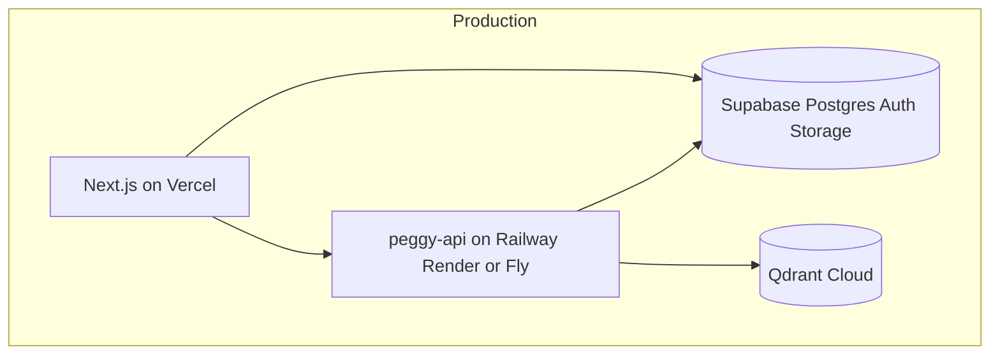

# Scale path: Vercel + Supabase (future)

**Current focus:** local dev per [LOCAL.md](LOCAL.md).  
**Future production:** this document is the target architecture — implement when local workflows are trusted.

## Target topology

| Layer | Local now | Scale to |
|-------|-----------|----------|
| Frontend | `npm run dev` | **Vercel** (`apps/web`) |
| API | Host `:8000` (`start-api.sh`) | **Railway / Render / Fly** |
| Vectors | Native Qdrant (`install-qdrant.sh`) | **Qdrant Cloud** |
| Catalog DB | SQLite volume | **Supabase Postgres** |
| Auth | None | **Supabase Auth** |
| File uploads | API multipart | **Supabase Storage** |
| Async jobs | FastAPI BackgroundTasks | **Inngest** (optional) |
| Rate limits | In-memory / Upstash stub | **Upstash Redis** |

## Migration checklist (when ready)

### Phase 1 — Deploy read-only demo
- [ ] Vercel: `apps/web`, `NEXT_PUBLIC_API_URL` → hosted API
- [ ] API host: `services/peggy-api`, env from `.env.example`
- [ ] Qdrant Cloud cluster; set `QDRANT_URL`

### Phase 2 — Supabase Postgres
- [ ] Create Supabase project
- [ ] Run migration (papers, ingest_jobs, feedback + `user_id`)
- [ ] Set `DATABASE_URL` on API; keep SQLite for local via unset `DATABASE_URL`
- See [DATABASE.md](DATABASE.md)

### Phase 3 — Supabase Auth
- [ ] `@supabase/ssr` in Next.js; login middleware
- [ ] API JWT verification; scope all queries by `user_id`
- See [AUTH.md](AUTH.md)

### Phase 4 — Hardening
- [ ] Remove CORS `*` wildcard
- [ ] Inngest for batch PubMed ingest
- [ ] CI smoke test against staging

## Env mapping (local → prod)

| Local `.env` | Production |
|--------------|------------|
| `LLM_PROVIDER=ollama` | `groq` or paid provider on API host |
| `GROQ_API_KEY` | API host secret (if groq) |
| `OPENAI_API_KEY` | API host secret (if openai) |
| `QDRANT_URL=http://localhost:6333` | Qdrant Cloud URL + API key |
| `SQLITE_DB=...` | `DATABASE_URL=postgresql://...` (Supabase) |
| `NEXT_PUBLIC_API_URL=http://localhost:8000` | `https://api.your-domain.com` |
| — | `NEXT_PUBLIC_SUPABASE_URL` |
| — | `NEXT_PUBLIC_SUPABASE_ANON_KEY` |

## What not to change for scale

- **Qdrant** for vectors (no rush to pgvector)
- **FastAPI** structure in `services/peggy-api/`
- **Workflow JSON schemas** (gap, compare, etc.)

Design choices today (SQLite, profile stub in `localStorage`, native processes) are **local-dev shortcuts**, not dead ends — each has a documented swap in [DATABASE.md](DATABASE.md) and [AUTH.md](AUTH.md).
