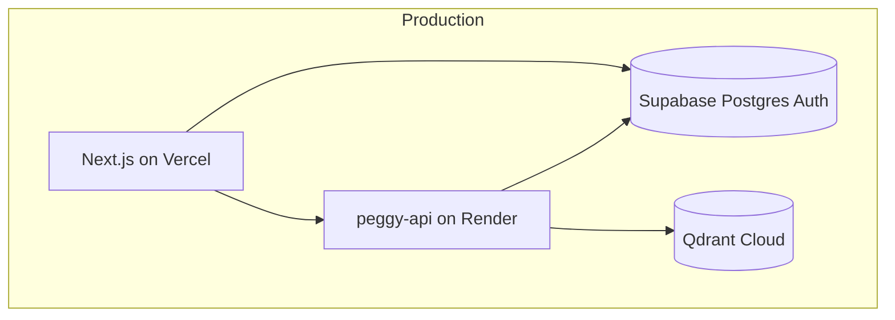

# Scale path — Milestone 1 vs 2

## Milestone 1 (implemented)

| Layer | Where |
|-------|--------|
| Frontend | Vercel (`apps/web`) — auth/login; local-dev banner when API unreachable |
| Full Peggy | **localhost** — API `:8000`, Qdrant `:6333`, `npm run dev` |
| Catalog + auth | **Supabase** Postgres + Auth (eu-west-1) |
| Vectors | Local Qdrant |

## Milestone 2 (Render + Qdrant Cloud)

| Layer | Where |
|-------|--------|
| Frontend | Vercel — `NEXT_PUBLIC_API_URL` → Render |
| API | **Render** — Docker web service (`services/peggy-api`) |
| Vectors | **Qdrant Cloud** |
| Catalog + auth | Supabase (unchanged) |

### Render setup checklist

1. **Qdrant Cloud** — create free cluster (EU region recommended); copy cluster URL + API key.
2. **Supabase** — migration applied; pooler `DATABASE_URL`; JWT secret from Settings → API.
3. **Render** — New Web Service:
   - Connect GitHub repo
   - **Root Directory:** `services/peggy-api`
   - **Runtime:** Docker
   - **Health Check Path:** `/health`
   - **Environment:** copy from [`services/peggy-api/.env.render.example`](../services/peggy-api/.env.render.example)
   - Or use Blueprint [`render.yaml`](../render.yaml) at repo root
4. **Deploy** — wait for build; note service URL `https://….onrender.com`
5. **Vercel** — set `NEXT_PUBLIC_API_URL` to Render URL; redeploy web app
6. **CORS** — on Render, `CORS_ORIGINS` must include your Vercel URL (comma-separated)
7. **Upstash Redis** (recommended) — `UPSTASH_REDIS_REST_URL` + `UPSTASH_REDIS_REST_TOKEN` for consistent hourly rate limits across restarts/instances. See [RESTRICTIONS.md](RESTRICTIONS.md).
8. **Smoke test:**

   ```bash
   API_URL=https://your-peggy-api.onrender.com ./scripts/smoke-remote.sh
   ```

### Free-tier tips

| Service | Tip |
|---------|-----|
| **Render free** | Spins down after idle; first request slow (cold start) |
| **Render RAM** | 512 MB may OOM on `sentence-transformers` — upgrade to 1 GB if ingest crashes |
| **Qdrant Cloud free** | One cluster; re-ingest after switching from local Qdrant |
| **Gemini** | Use `LLM_PROVIDER=gemini` + `GEMINI_API_KEY` on Render (no Ollama) |

Collections are created automatically: `peggy_literature`, `peggy_own_findings`, `chat_history_logs` (384-dim cosine). Cluster **display name** in Qdrant UI does not matter — only URL + API key.

## Target topology (Milestone 2)


```mermaid
flowchart TB
  subgraph prod [Production]
    Vercel[Next.js on Vercel]
    Supa[(Supabase Postgres Auth)]
    QdrantCloud[(Qdrant Cloud)]
    APIHost[peggy-api on Render]
  end
  Vercel --> Supa
  Vercel --> APIHost
  APIHost --> Supa
  APIHost --> QdrantCloud
```

## Env mapping (local → production)

| Local `.env` | Render / production |
|--------------|---------------------|
| `LLM_PROVIDER=ollama` | `LLM_PROVIDER=gemini` + `GEMINI_API_KEY` |
| `QDRANT_URL=http://localhost:6333` | `QDRANT_URL` + `QDRANT_API_KEY` (Qdrant Cloud) |
| `SQLITE_DB` / unset `DATABASE_URL` | `DATABASE_URL` → Supabase pooler `:6543` |
| `AUTH_REQUIRED=false` (tests) | `AUTH_REQUIRED=true` |
| `CORS_ORIGINS=http://localhost:3000` | `https://your-app.vercel.app,http://localhost:3000` |
| — | `UPSTASH_REDIS_REST_URL` + token (recommended) |

See [ENV.md](ENV.md), [DATABASE.md](DATABASE.md), [AUTH.md](AUTH.md).
